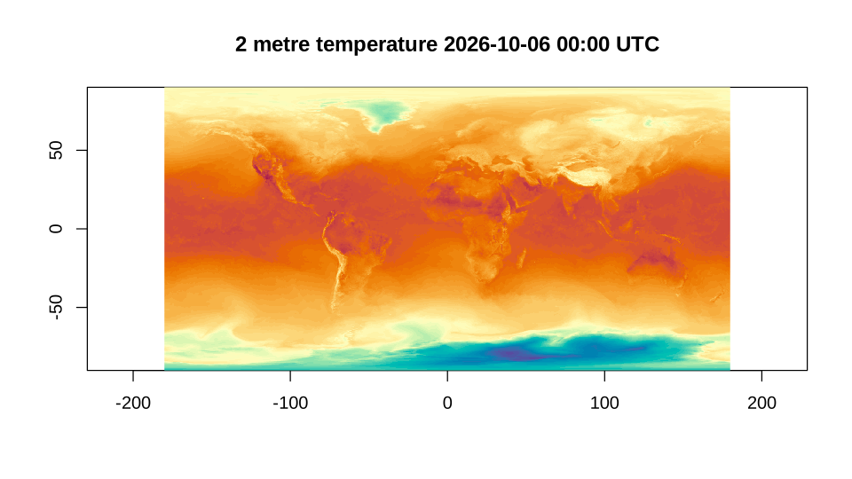

# Icechunk: versioned Zarr through GDAL

[Icechunk](https://icechunk.io) is a transactional storage engine for
Zarr. A Zarr store is a tree of JSON documents and chunk files; an
Icechunk repository holds the same tree, but every change to it is a
commit, and the repository keeps branches and tags that point at commits
the way git does. A reader always sees one complete snapshot, never a
half-finished write, and a tag or a commit is a permanent name for the
data as it was.

GDAL reads Icechunk from version 3.14, with a driver that needs nothing
beyond the Zarr driver and libzstd: no Rust and no Python. The
background, and the same stores read from Python, terra, sf and
gdalraster, are in the post [Icechunk is
coming](https://www.hypertidy.org/posts/2026-06-26_icechunk-is-coming/).
This article is the GDAL7 side of it.

## Does this GDAL have the driver?

A driver is there or not depending on how GDAL was built, so ask the
library rather than the version number:

``` r

library(GDAL7)
drivers <- gdal_drivers()
drivers[drivers$short_name %in% c("Zarr", "Icechunk"), ]
#>    short_name long_name raster vector multidim create  copy  vsi extensions
#> 15       Zarr      Zarr   TRUE  FALSE     TRUE   TRUE  TRUE TRUE       zarr
#> 16   Icechunk  Icechunk   TRUE  FALSE     TRUE  FALSE FALSE TRUE       <NA>
```

Everything below needs the driver. Code that has to run anywhere can
make the same test and step around it:

``` r

has_icechunk <- "Icechunk" %in% gdal_drivers()$short_name
```

To Icechunk, GDAL is a multidimensional driver like Zarr or netCDF, so a
repository is opened with `multidim = TRUE` and read with the functions
in the
[Multidimensional](https://rgdal-dev.github.io/GDAL7/reference/index.html#multidimensional)
section of the reference.

## A repository with some history

GDAL7 ships a small repository, built by
`data-raw/make_icechunk_fixture.py` with the icechunk Python library
(GDAL reads Icechunk but does not write it). It holds one array,
`temperature`, over 3 time steps on a 10 degree global grid, and it has
a history:

- on `main`, a first commit, tagged `v1`, and a second commit that
  raises the second time step by 100;
- a branch `experiment`, which starts from `v1` and lowers every value
  by 50.

The repository is a directory, and that is all GDAL needs to be given:

``` r

repo <- system.file("extdata/temperature.icechunk", package = "GDAL7")

ds <- gdal_open(repo, multidim = TRUE)
root <- get_root_group(ds)
root@mdarray_names
#> [1] "lat"         "lon"         "temperature" "time"

temperature <- open_mdarray(root, "temperature")
temperature@dimensions
#>   name size         type direction indexed
#> 1 time    3     TEMPORAL              TRUE
#> 2  lat   18 HORIZONTAL_Y     NORTH    TRUE
#> 3  lon   36 HORIZONTAL_X      EAST    TRUE
temperature@block_size
#> time  lat  lon 
#>    1    9   18
temperature@unit_type
#> [1] "degC"
```

`dimensions` and `block_size` are in GDAL’s order, slowest varying
first.
[`read_mdarray()`](https://rgdal-dev.github.io/GDAL7/reference/read_mdarray.md)
gives `dim` the other way round, the order ncdf4 and RNetCDF use, which
is also the order the values arrive in:

``` r

values <- read_mdarray(temperature)
dim(values)
#>  lon  lat time 
#>   36   18    3
temperature@dimension_values$lat
#>  [1]  85  75  65  55  45  35  25  15   5  -5 -15 -25 -35 -45 -55 -65 -75 -85
```

## Branches, tags and time travel

What GDAL opens by default is the head of `main`. The branches and tags
are listed by the driver’s own algorithms,
`gdal driver icechunk list-branches` and `list-tags` on the command
line.
[`gdal_run()`](https://rgdal-dev.github.io/GDAL7/reference/gdal_run.md)
runs them (it needs GDAL’s algorithm API, which Icechunk-capable builds
have) and gives back their JSON:

``` r

branches <- gdal_run("driver icechunk list-branches", list(input = repo))
jsonlite::fromJSON(branches)[, c("name", "commit_message")]
#>         name               commit_message
#> 1 experiment    try an offset on a branch
#> 2       main correct the second time step

tags <- gdal_run("driver icechunk list-tags", list(input = repo))
jsonlite::fromJSON(tags)[, c("name", "commit_message")]
#>   name               commit_message
#> 1   v1 first version of temperature
```

Another branch or a tag is chosen in the connection string: prefix the
path with `ICECHUNK:` and add `?branch=` or `?tag=`. A small helper
keeps the reads short:

``` r

read_temperature <- function(dsn) {
  ds <- gdal_open(dsn, multidim = TRUE)
  on.exit(gdal_close(ds))
  read_mdarray(open_mdarray(get_root_group(ds), "temperature"))
}

v1 <- read_temperature(paste0("ICECHUNK:", repo, "?tag=v1"))
experiment <- read_temperature(paste0("ICECHUNK:", repo, "?branch=experiment"))
```

`main` differs from `v1` in the second time step only, and `experiment`
differs from it everywhere:

``` r

apply(values - v1, 3, function(d) round(range(d), 4))
#>      [,1] [,2] [,3]
#> [1,]    0  100    0
#> [2,]    0  100    0
apply(experiment - v1, 3, function(d) round(range(d), 4))
#>      [,1] [,2] [,3]
#> [1,]  -50  -50  -50
#> [2,]  -50  -50  -50
```

A tag never moves, and that makes it the right thing to build anything
long-lived on.
[`as_altarr()`](https://rgdal-dev.github.io/GDAL7/reference/as_altarr.md)
(with the altarr package installed) makes a lazy array that keeps the
path and reopens it in a new session; altarr asks that the source not
change underneath it, and an Icechunk tag is a promise that it will not:

``` r

lazy <- as_altarr(paste0("ICECHUNK:", repo, "?tag=v1"), array = "temperature")
dim(lazy)
#> [1] 36 18  3
mean(lazy[, , 2])
#> [1] 20.93571
```

A branch is the opposite: the same string names whatever its head is
when it is opened.

## As an ordinary raster

A two-dimensional slice is a raster, and
[`as_classic_dataset()`](https://rgdal-dev.github.io/GDAL7/reference/as_classic_dataset.md)
turns it into a `GDALDataset` with a geotransform worked out from the
coordinate variables, so the rest of GDAL7 applies:

``` r

second <- as_classic_dataset(get_view(temperature, "[1,:,:]"))
second@geotransform
#>        origin_x     pixel_width    row_rotation        origin_y column_rotation 
#>            -180              10               0              90               0 
#>    pixel_height 
#>             -10
c(second@raster_xsize, second@raster_ysize)
#> [1] 36 18
```

## Underneath: /vsiicechunk/

The repository on disk is not a Zarr store. It has a `repo` file, and
directories of snapshots, manifests, transactions and chunks whose names
are identifiers rather than array paths:

``` r

setdiff(vfs_list(repo), c(".", ".."))
#> [1] "transactions" "snapshots"    "chunks"       "repo"         "manifests"
```

The driver works by presenting the Zarr store a snapshot describes as a
virtual file system, `/vsiicechunk/`, and handing that to the Zarr
driver. The same file system can be listed and read directly, which is
the low-level way to see what a repository holds. Braces mark where the
repository’s own path ends:

``` r

logical <- sprintf("/vsiicechunk/{%s}", repo)
vfs_list(logical)
#> [1] "zarr.json"   "lat"         "lon"         "temperature" "time"

meta <- jsonlite::fromJSON(rawToChar(
  vfs_read_file(paste0(logical, "/temperature/zarr.json"))
))
meta$shape
#> [1]  3 18 36
meta$codecs$name
#> [1] "bytes" "zstd"
```

[`vfs_read_file()`](https://rgdal-dev.github.io/GDAL7/reference/vfs_read_file.md)
gives raw bytes, so the JSON is turned into text first.

## A forecast in the cloud

The repositories worth reading are on object storage. dynamical.org
publishes ECMWF’s AIFS forecasts as an Icechunk repository on S3, open
to anonymous reads. GDAL’s S3 settings are configuration options;
[`with_gdal_config()`](https://rgdal-dev.github.io/GDAL7/reference/gdal_config.md)
sets them for one block and puts them back afterwards, while
[`gdal_config()`](https://rgdal-dev.github.io/GDAL7/reference/gdal_config.md)
sets them for the session, which is what is done here:

``` r

gdal_config("AWS_NO_SIGN_REQUEST", "YES")
gdal_config("AWS_REGION", "us-west-2")

aifs <- "/vsis3/dynamical-ecmwf-aifs-single/ecmwf-aifs-single-forecast/v0.1.0.icechunk"
```

The repository has one branch, and its last commit says when it was
updated:

``` r

jsonlite::fromJSON(gdal_run("driver icechunk list-branches", list(input = aifs)))
#>   name                 commit_message                timestamp
#> 1 main Update at 2026-10-06T06:14:01Z 2026-10-06T06:14:03.352Z
```

Opening it reads the repository file, a snapshot and the array metadata,
not the data:

``` r

ds <- gdal_open(aifs, multidim = TRUE)
root <- get_root_group(ds)
root@mdarray_names
#>  [1] "init_time"                                 
#>  [2] "latitude"                                  
#>  [3] "lead_time"                                 
#>  [4] "longitude"                                 
#>  [5] "dew_point_temperature_2m"                  
#>  [6] "downward_long_wave_radiation_flux_surface" 
#>  [7] "downward_short_wave_radiation_flux_surface"
#>  [8] "expected_forecast_length"                  
#>  [9] "geopotential_height_500hpa"                
#> [10] "geopotential_height_850hpa"                
#> [11] "geopotential_height_925hpa"                
#> [12] "ingested_forecast_length"                  
#> [13] "precipitation_surface"                     
#> [14] "pressure_reduced_to_mean_sea_level"        
#> [15] "pressure_surface"                          
#> [16] "spatial_ref"                               
#> [17] "temperature_2m"                            
#> [18] "temperature_850hpa"                        
#> [19] "temperature_925hpa"                        
#> [20] "total_cloud_cover_atmosphere"              
#> [21] "valid_time"                                
#> [22] "wind_u_100m"                               
#> [23] "wind_u_10m"                                
#> [24] "wind_v_100m"                               
#> [25] "wind_v_10m"

t2m <- open_mdarray(root, "temperature_2m")
t2m@dimensions
#>        name size         type direction indexed
#> 1 init_time 3673                           TRUE
#> 2 lead_time   61                           TRUE
#> 3  latitude  721 HORIZONTAL_Y              TRUE
#> 4 longitude 1440 HORIZONTAL_X              TRUE
t2m@block_size
#> init_time lead_time  latitude longitude 
#>         1        61       241       240
```

A chunk is one forecast run, all 61 lead times, on a 241 by 240 tile, so
a whole globe at one lead time touches 18 chunks. `init_time` is in
seconds since 1970:

``` r

init <- t2m@dimension_values$init_time
latest <- length(init)
run <- format(as.POSIXct(init[latest], origin = "1970-01-01", tz = "UTC"),
              "%Y-%m-%d %H:%M UTC")
run
#> [1] "2026-10-06 00:00 UTC"
```

[`advise_read()`](https://rgdal-dev.github.io/GDAL7/reference/advise_read.md)
tells the Zarr driver what is coming, so it fetches and decodes those
chunks on GDAL’s threads at once, and the read that follows is served
from them:

``` r

start <- c(latest, 1, 1, 1)
count <- c(1, 1, 721, 1440)
advise_read(t2m, start = start, count = count)
analysis <- read_mdarray(t2m, start = start, count = count)
dim(analysis)
#> longitude  latitude lead_time init_time 
#>      1440       721         1         1
range(analysis)
#> [1] -66.00  39.75
```

The values are `[longitude, latitude]`, with latitude running from north
to south as it is stored, so
[`image()`](https://rdrr.io/r/graphics/image.html) needs it reversed:

``` r

lon <- t2m@dimension_values$longitude
lat <- t2m@dimension_values$latitude
grid <- analysis[, , 1, 1]
image(lon, rev(lat), grid[, rev(seq_along(lat))], asp = 1,
      col = hcl.colors(64, "Spectral", rev = TRUE),
      xlab = "", ylab = "", useRaster = TRUE)
title(paste(t2m@attributes$long_name, run))
```



plot of chunk remote-plot

## Codecs are a build question

Not every repository opens on every build. Earthmover’s ERA5 repository
(the example in [this
gist](https://gist.github.com/mdsumner/2aa9ba53a9272c82de72b62f6f19ce1c))
is in another region, still anonymous, and it opens and lists fine:

``` r

era5 <- "/vsis3/earthmover-icechunk-era5/icechunkV2"
with_gdal_config(c(AWS_REGION = "us-east-1"), {
  print(vfs_list(sprintf("/vsiicechunk/{%s}/pressure/spatial", era5)))
  era5_ds <- gdal_open(era5, multidim = TRUE)
  t_era5 <- open_mdarray(get_root_group(era5_ds), "/pressure/spatial/t")
})
#>  [1] "zarr.json"      "latitude"       "longitude"      "lsm"           
#>  [5] "pressure_level" "pv"             "q"              "r"             
#>  [9] "sdor"           "slor"           "status"         "t"             
#> [13] "u"              "v"              "valid_time"     "w"             
#> [17] "z"              "z_sfc"
#> Warning: GDAL: /pressure/spatial/t: Codec 'numcodecs.pcodec' is supported by
#> GDAL, but not in this particular build. Requires building GDAL with
#> -DGDAL_USE_PCODEC=ON and with a Rust toolchain available
is.null(t_era5)
#> [1] TRUE
```

but its arrays are compressed with pcodec, which GDAL supports only when
it is built with `-DGDAL_USE_PCODEC=ON` and a Rust toolchain. The
warning says so; the answer is a GDAL built with it, not anything in R.
The array’s codecs are in its `zarr.json` for anyone who wants to check
before opening:

``` r

with_gdal_config(c(AWS_REGION = "us-east-1"), {
  meta <- vfs_read_file(sprintf("/vsiicechunk/{%s}/pressure/spatial/t/zarr.json", era5))
})
jsonlite::fromJSON(rawToChar(meta))$codecs$name
#> [1] "numcodecs.pcodec"
```

## Credentials, branches and other options

- A private bucket needs credentials instead of `AWS_NO_SIGN_REQUEST`:
  `AWS_ACCESS_KEY_ID` and `AWS_SECRET_ACCESS_KEY`, or a profile with
  `AWS_PROFILE`, and `AWS_S3_ENDPOINT` for storage that is not AWS.
  These are all GDAL configuration options, set with
  [`gdal_config()`](https://rgdal-dev.github.io/GDAL7/reference/gdal_config.md)
  or
  [`with_gdal_config()`](https://rgdal-dev.github.io/GDAL7/reference/gdal_config.md);
  GDAL also reads them from the environment.
- `ICECHUNK:<path>?branch=<name>` and `ICECHUNK:<path>?tag=<name>`
  choose what is read. Adding `&ignore-timestamp-etag=yes` skips the
  check that a chunk file has not changed since it was referenced.
- Virtual chunk references, which point into netCDF or HDF5 files
  elsewhere rather than holding the bytes, are followed through GDAL’s
  own file systems (`https://` becomes `/vsicurl/https://`, `s3://`
  becomes `/vsis3/`), so the same configuration options apply to them.

The driver’s documentation is at
<https://gdal.org/en/latest/drivers/raster/icechunk.html>.
